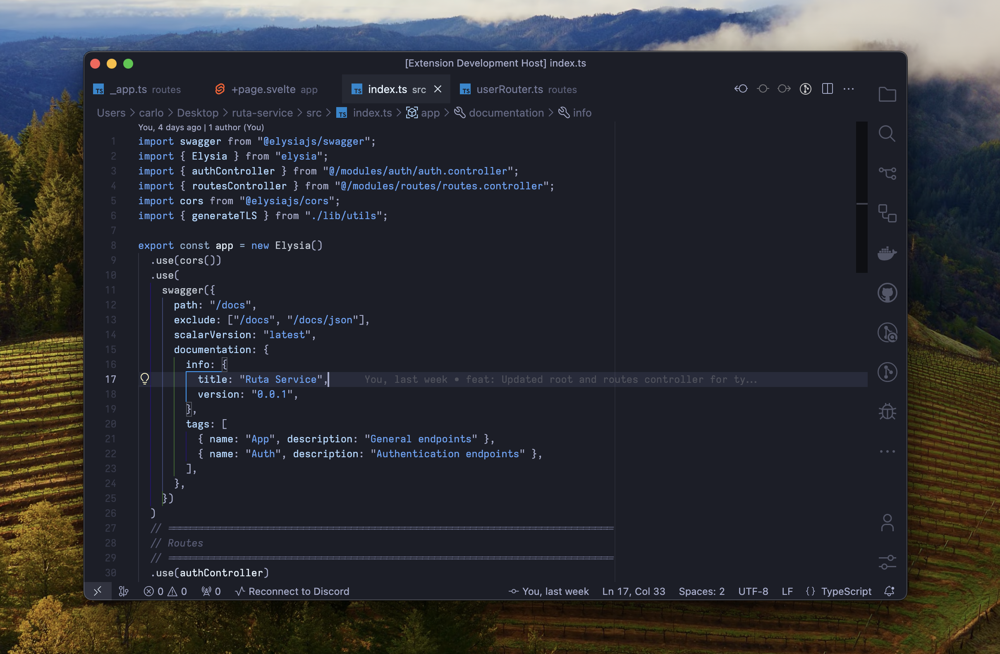

<p align="middle">
  <!--  -->
  
</p>

Blankeos Zen is my own personal, minimal, and frameless dark-theme inspired mostly by [poimandres](https://github.com/drcmda/poimandres-theme). Sometimes I don't feel the green in poimandres and wanted a bluer vibe to my editor. That's why I made this.

The screencap above uses the following settings:

<!-- ```json
{
  "workbench.colorTheme": "poimandres",
  "workbench.iconTheme": "quill-icons-minimal",
  "workbench.productIconTheme": "icons-carbon",
  "editor.renderIndentGuides": false,
  "editor.renderWhitespace": "none",
  "editor.minimap.renderCharacters": false,
  "editor.fontSize": 13.5,
  "editor.fontFamily": "Menlo",
  "window.zoomLevel": 0.5,
}
``` -->

#### Contribute

    git clone https://github.com/Blankeos/blankeos-zen-theme
    cd blankeos-zen-theme
    npm install
    npm run dev

Go to `Run and Debug`, click the ▶ icon, any change you make in `src/theme.js` will now be reflected when you save.

<!-- ## Related

- [poimandres-alacritty][poimandres-alacritty]: Alacritty version
- [poimandres-iterm][poimandres-iterm]: Iterm version
- [poimandres-kitty][poimandres-kitty]: Kitty version
- [poimandres-nvim][poimandres-nvim]: Neovim version
- [poimandres-jetbrains][poimandres-jetbrains]: JetBrains version

[poimandres-alacritty]: https://github.com/z0al/poimandres-alacritty
[poimandres-iterm]: https://github.com/alii/poimandres-iterm
[poimandres-kitty]: https://github.com/guilhermedeandrade/poimandres-kitty
[poimandres-nvim]: https://github.com/olivercederborg/poimandres.nvim
[poimandres-jetbrains]: https://github.com/marko-mihajlovic/poimandres-jetbrains

### Hyper theme

```bash
hyper i hyper-pmndrs
``` -->
